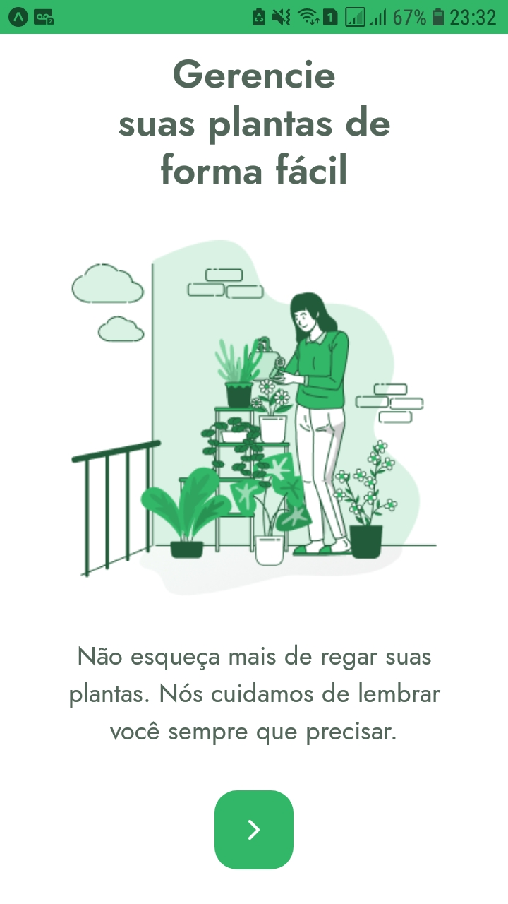
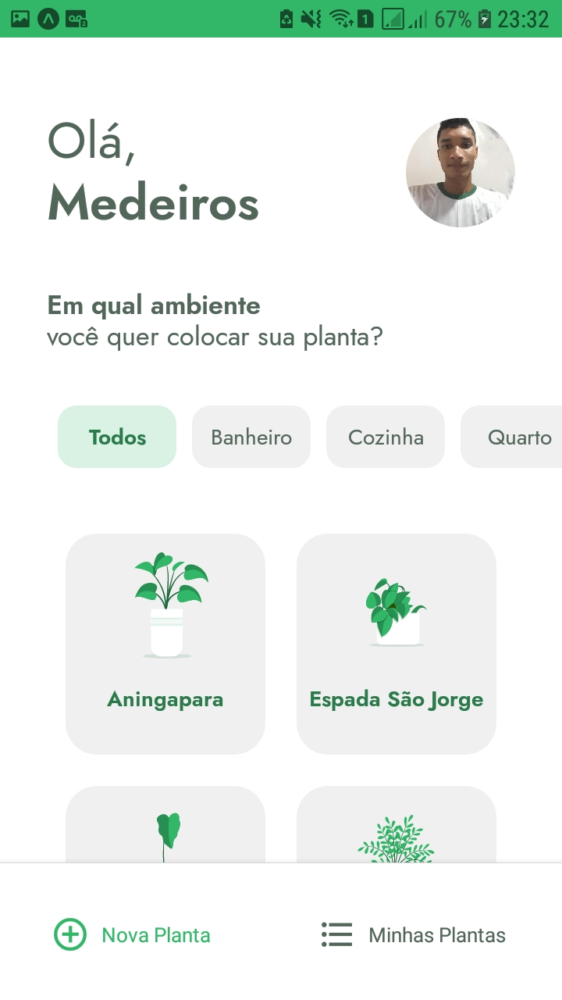
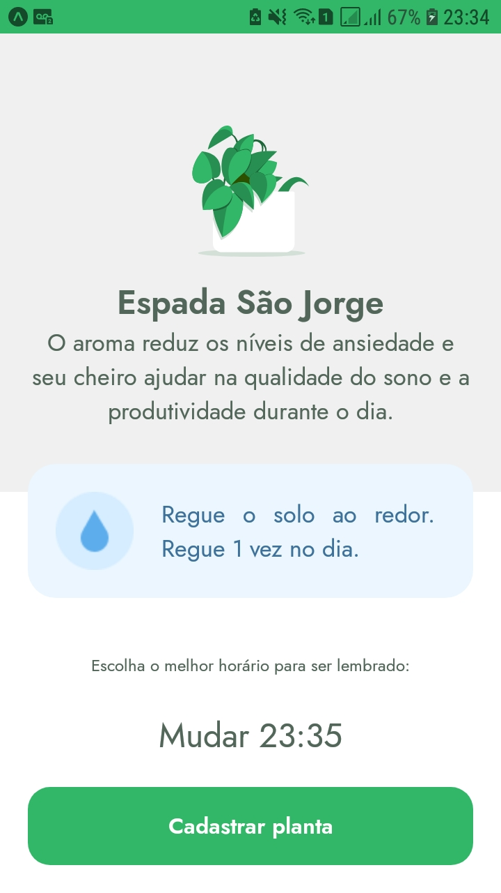
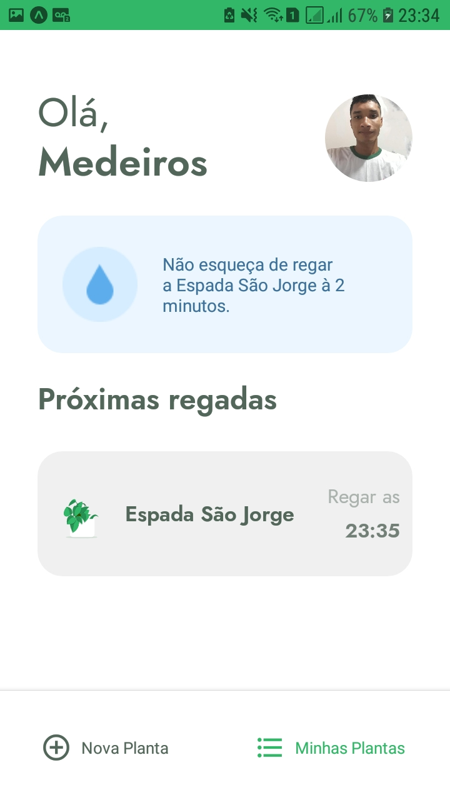
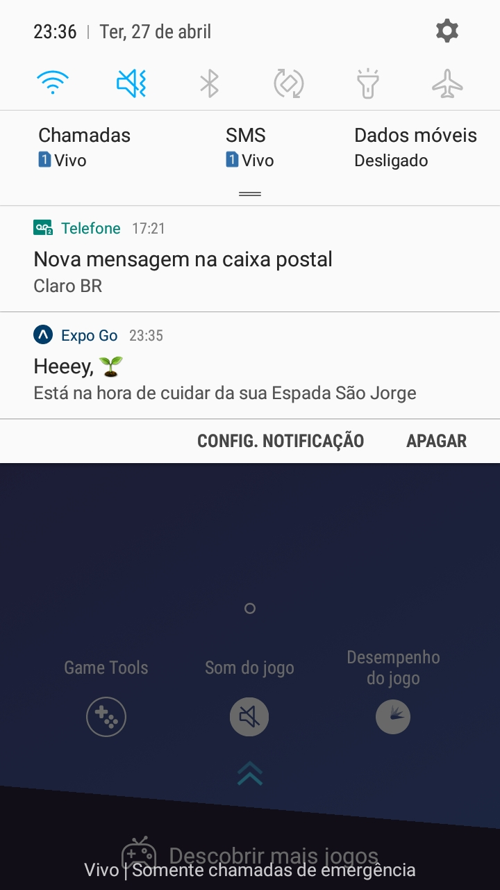
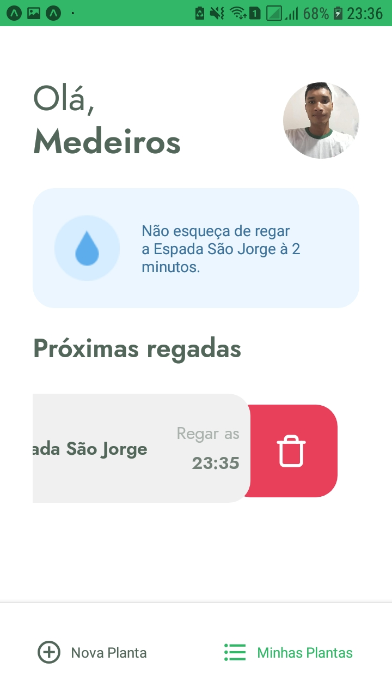

<h1 align="center">
  
</h1>

# ✅ Descrição do Projeto
Aplicação construída na 5º edição do NLW (Next Level Week) na trila de React Native, realizada pela [Rocketseat](https://rocketseat.com.br/). 
Tem como objetivo, gerenciar o tratamento e cuidado com as plantas, ou seja, o usuario seleciona as plantas e horaio, assim a aplicação informa os horários atravéis de notificações, para regar e como devem ser tratadas de acordo com o ambiente e comodo da casa.  

# 🎁 Imagens do resultado do projeto
Neste [link](https://www.figma.com/file/KJ9GRw8dgniiepGlRyROR5/PlantManager-(Copy)) do figma pode ser visualizado todo o layout do app disponibilizado pela Rocketseat.   
<h1 align="center">
  
  
  
  
  
  
  
</h1>

  

# 🎲 Pré-requisitos e como rodar a aplicação
## Pré-requisitos

Antes de começar, você vai precisar ter instalado em sua máquina as seguintes ferramentas:
- [Expo](https://docs.expo.io/);
- [Git](https://git-scm.com);
- [Node.js](https://nodejs.org/en/);
- Um editor de código, recomendo o [VSCode](https://code.visualstudio.com/).
- Baixe o aplicativo [Expo Go](https://expo.io/client) em seu celular, pois é por ele que você poderá ver o aplicativo rodando.
- Você também precisará instalar o [JSON Server](https://github.com/typicode/json-server) em sua máquina, pois ele será reponsável por rodar a api;   

⚠️ Observção e informações Importante:  
Como o foco era a aplicação mobile, não foi criado no evento a api da aplicação, a api ultilizada e disponibilizada pela Rocketseat foi uma fictícia, que esta na pasta 'services' com o nome de 'server.json'.  

Após fazer o clone do repositório.  
Abra o arquivo 'api.ts' que esta dentro da pasta 'services' e edite a 'baseURL' de acordo com as informações abaixo:  
- pegue o edereço ip da sua máquina, e adcione na url da 'baseURL', como mostrado a seguir;
- baseURL: 'http://Ip:3333' - Onde esta escrito 'Ip' troque pelo edereço ip da sua maquina.   

Para rodar a api fictiícia siga os passos abaixo:
- abra uma nova janela no seu terminal, vá até a pasta do projeto
- execute o comando abaixo, onde está escrito 'Ip' troque pelo seu Ip que adcionou na url da 'baseURL'
- json-server ./src/services/server.json --host Ip --port 3333 --delay 700    

## 🏁 Rodando e executando a aplicação 💻 
 ### Clone este repositório
* 
git clone https://github.com/WillianMedeiros14/plantmanager.git

### Acesse a pasta do projeto no terminal/cmd
* cd plantmanager

### Instale as dependências
* yarn install

### Execute o projeto
* expo start

Após isso, aguarde abrir uma janela no seu navegador. Aguarde aparecer um qrcode no canto inferior esquerdo.

### Visualizando o aplicativo e rodando em seu celular
- Quando o qrcode aparecer na aba que abriu em seu navegador, abra o aplicativo Expo Go em seu celular e escaneie o qrcode.
- Aguarde a porcentagem chegar a 100% e o aplicativo abrirá em seu celular.    

## 💬 Como ultilizar e informações do aplicativo 🤳🏾

- Digite seu nome e prosiga apertando os botões.
- Na tela de 'Nova planta' escolha uma planta por vêz para salvar e receber notificações dos horários para regar.
- As plantas ecolhidas irão aparecer na aba de 'Minhas Plantas'.
- Para deletar uma planta escolhida, pressione em cima da planta e arraste para a esquerda, então aparecerá um botão para deletar.    

## 🛠 Tecnologias
As seguintes ferramentas foram ultilizada na construção do projeto:

- [Expo](https://expo.io/)
- [React Native](https://reactnative.dev/)
- [React Navigation](https://reactnavigation.org/)
- TypeScript
- Push Notifications do expo